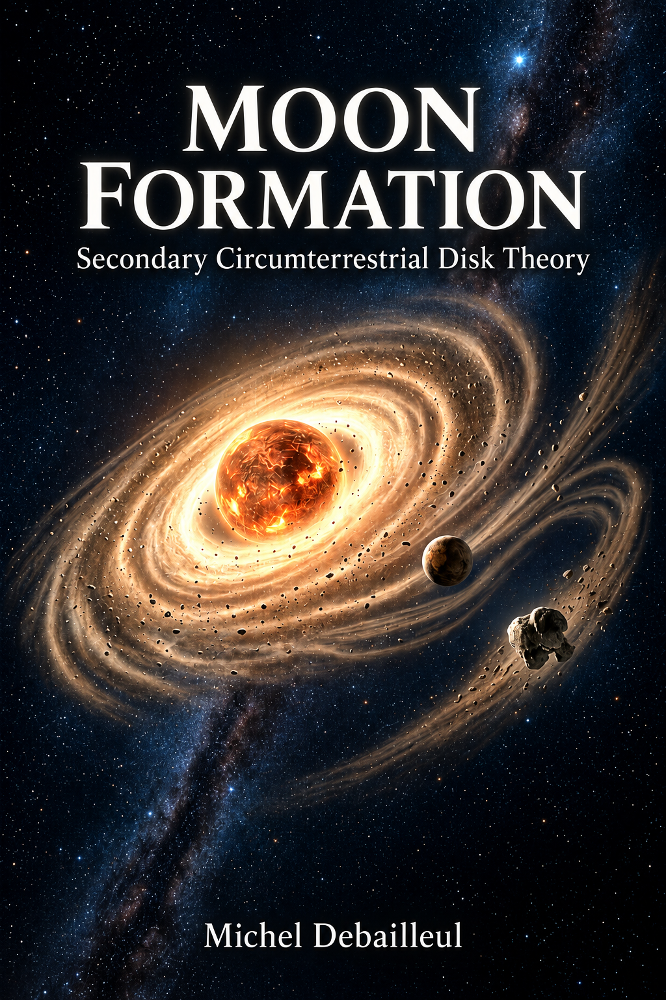

# Moon Formation / Formation de la Lune

## Secondary Circumterrestrial Disk Theory / Théorie du disque secondaire circumterrestre

[Lire la version française du README](README_FR.md)

**Author:** Michel Debailleul  
**Geophysicist
**Version:** v1.0.0 — Foundational release  
**License:** CC BY-NC 4.0  
**DOI:** forthcoming after Zenodo release

---

## Covers

### English cover



### French cover


---

## Overview

This repository contains the French and English versions of the monograph:

**Formation de la Lune — Théorie du disque secondaire circumterrestre**  
**Moon Formation — Secondary Circumterrestrial Disk Theory**

The work proposes a **retrodictive physical path theory** for the formation of the Earth–Moon system.

It does not claim to reconstruct uniquely what actually happened in Solar System history. Instead, it investigates whether there exists a continuous, physically admissible, quantitatively constrained and falsifiable path linking a possible proto-terrestrial state to the observed Earth–Moon system.

---

## Scientific idea

The theory is based on four central elements:

1. A pre-existing **secondary circumterrestrial disk** or reservoir around the proto-Earth.
2. A grazing, non-collisional passage of a planetary body named **B**.
3. A redistribution of mass and angular momentum between circumterrestrial and proto-terrestrial reservoirs.
4. Orbital sorting of material, allowing part of the disk material to circularise beyond the Roche limit and contribute to lunar formation.

In this framework, planet **B** is not treated as a lunar precursor, an impactor, or the main supplier of lunar material.

It is defined as a transient gravitational agent:

> Planet B acts as a temporary gravitational agent redistributing mass and angular-momentum fluxes between the circumterrestrial and proto-terrestrial reservoirs.

Its later disappearance is interpreted within the broader context of planetary bodies present in the primitive Solar System but absent from the present one.

---

## Methodological status

This work is a **path theory**, not a claim of historical uniqueness.

The central question is therefore not:

> Which unique event actually occurred?

but rather:

> Does there exist a continuous, quantitatively constrained and falsifiable physical path linking a possible proto-terrestrial state to the observed Earth–Moon system?

The theory becomes credible if a continuous domain of parameters satisfies the dynamical, geochemical, isotopic, thermodynamic and chronological constraints together.

It is falsified if no such domain exists.

---

## Repository contents

### Monographs

- `Formation_Lune_Theorie_disque_secondaire_circumterrestre.pdf`  
  French full monograph in PDF format.

- `Formation_Lune_Theorie_disque_secondaire_circumterrestre.tex`  
  French LaTeX source file.

- `Moon_Formation_Secondary_Circumterrestrial_Disk_Theory.pdf`  
  English full monograph in PDF format.

- `Moon_Formation_Secondary_Circumterrestrial_Disk_Theory.tex`  
  English LaTeX source file.

### Book covers

- `Couverture LUNE FR.png`  
  French book cover.

- `Cover_Moon_Formation_EN.png`  
  English book cover.

### Figures

- `Carte_etaL_pilote.png`  
  French pilot heat map of the fraction placed in the lunar window.

- `Map_etal_driver.png`  
  English pilot heat map of the fraction placed in the lunar window.

### Archive

- `Formation_Lune_Moon_Formation_STRICT_FR_EN.zip`  
  Complete archive containing the French and English LaTeX sources, PDFs and figures.

---

## French version

**Title:**  
*Formation de la Lune — Théorie du disque secondaire circumterrestre*

**Main file:**  
`Formation_Lune_Theorie_disque_secondaire_circumterrestre.pdf`

This version presents the complete French monograph, including the physical hypothesis, dynamical framework, reservoir architecture, geochemical constraints, viability domain and testable predictions.

---

## English version

**Title:**  
*Moon Formation — Secondary Circumterrestrial Disk Theory*

**Main file:**  
`Moon_Formation_Secondary_Circumterrestrial_Disk_Theory.pdf`

This version is the English counterpart of the French monograph and follows the same structure, concepts and scientific argument.

---

## Keywords

Moon formation; circumterrestrial disk; secondary accretion; non-collisional encounter; orbital sorting; angular momentum; Roche limit; lunar geochemistry; primordial orbital instability; eliminated planet.

---

## Suggested citation

Until a DOI is assigned, please cite this work as:

```text
Debailleul, Michel. 2026.
Moon Formation / Formation de la Lune:
Secondary Circumterrestrial Disk Theory / Théorie du disque secondaire circumterrestre.
Foundational release v1.0.0.
GitHub repository.
```

After Zenodo publication, the DOI citation should be used.

---

## License

This work is licensed under the:

**Creative Commons Attribution-NonCommercial 4.0 International License**  
**CC BY-NC 4.0**

© 2026 Michel Debailleul.

You are free to share and adapt the work for non-commercial purposes, provided appropriate credit is given.

Commercial use is not permitted without permission from the author.

---

## Contact

**Michel Debailleul**  
Independent researcher  
ORCID: 0009-0003-1222-1433

---

## Disclaimer

This repository presents a scientific hypothesis and a retrodictive theoretical framework.

It is intended for discussion, testing, criticism and further development.

The theory is not presented as a proven reconstruction of lunar formation, but as a quantitatively testable physical path.
