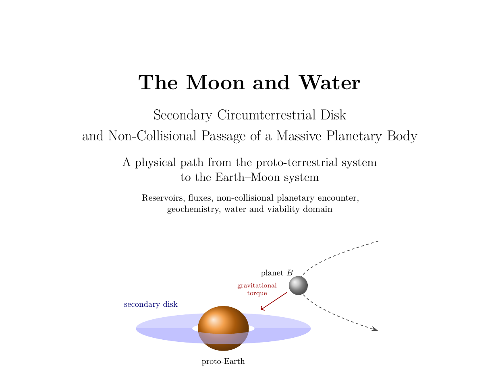

# The Moon and Water

## Secondary Circumterrestrial Disk and Non-Collisional Passage of a Massive Planetary Body

[Lire la version française de ce README](README_FR.md)

**Author:** Michel Debailleul
**Academic background:** Geophysicist — M.Sc., Université libre de Bruxelles (ULB)
**Version:** v2.0
**License:** CC BY-NC 4.0
**DOI:** https://doi.org/10.5281/zenodo.22770198
**ORCID:** 0009-0003-1222-1433


---

## What this work proposes

A physical path from the proto-terrestrial system to the Earth–Moon system, in which a single
event accounts for both the Moon and terrestrial water.

The proto-Earth rotates close to its limit, dilated by some thirteen per cent, its surface a magma
ocean whose iron has already migrated to the core. It carries a secondary disk, as forming planets
do. A body arriving from the cold regions of the system passes at three Earth radii, prograde,
slightly inclined so as to clear the disk.

During the few hours it is close, its tidal field lifts material from the intertropical belt of the
magma ocean and strips metal-depleted silicate. That material joins the disk, circularizes, and
transport carries it beyond the Roche limit where it accretes into a single satellite. At the same
time the passing body undergoes the reverse: its icy envelope, heated by the radiation of the magma
ocean, dilates until it overflows its own Roche lobe and yields its volatiles to the terrestrial
system. The exchange is asymmetric, each body giving what its nature allows it to give.

The body then departs, carrying away part of the stripped terrestrial material and with it the
excess angular momentum, and leaving behind a trail that will keep falling back for tens of
millions of years.

---

## Main results

**A single condition.** The specific angular momentum carried by each stripped layer admits a
closed form in which the rotation term and the tidal impulse term share the same radial dependence.
The condition for crossing the Roche limit therefore reduces to one quantity combining the reduced
rotation of the proto-Earth, its dilation, the mass of the perturber and its approach distance.

**A level surface, not a volume.** Along the contour producing one lunar mass, that quantity stays
constant to better than 0.5 %, including when the approach distance is varied. The viable domain is
a one-parameter family: constraining one quantity fixes the others.

**A confined uncertainty.** Changing the internal structure of the proto-Earth alters the mass
produced by a factor of nine, but shifts the threshold by only six per cent.

**A prograde passage is required.** The tidal impulse reverses sign in the retrograde case and
closes the injection channel entirely. A test-particle calculation confirms this independently for
the pre-existing reservoir: prograde, 18.5 % of the reservoir reaches the lunar window and 84 % of
the mass stays bound; retrograde, the window fraction falls to 4.0 % and 42.5 % escapes.

**Geochemistry follows from geometry.** The stripped material comes from the outer layers, hence
from silicate whose metal has already left. The iron deficit, the isotopic identity in O, Ti, Cr
and W, and the terrestrial signature of lunar water are consequences of provenance rather than
independent hypotheses.

---

## Methodological status

This is a **path theory**, and the distinction matters. The question addressed is not which unique
event occurred, but whether a continuous, quantitatively constrained and falsifiable path links a
possible proto-terrestrial state to the observed Earth–Moon system.

The work defines a viable domain as the intersection of seventeen gates, and states for each one
whether it has been cleared, sketched, or still requires calculation. Three are cleared on
quantitative grounds. Four require a calculation not yet carried out. The remainder rest on
established but unquantified arguments. That map is given explicitly in the monograph.

The theory is falsified if no continuous domain satisfies the dynamical, geochemical, isotopic,
thermodynamic and chronological constraints together.

---

## Repository contents

| File | Description |
| --- | --- |
| `LuneEau.tex` | French LaTeX source |
| `LuneEau.pdf` | French monograph, 95 pages |
| `MoonWater.tex` | English LaTeX source |
| `MoonWater.pdf` | English monograph, 95 pages |
| `couverture_FR.png` | French title page |
| `cover_EN.png` | English title page |

Both sources are self-contained: every figure is drawn in TikZ, so no external image is required.

---

## Compiling

```
pdflatex -interaction=nonstopmode MoonWater.tex
pdflatex -interaction=nonstopmode MoonWater.tex
pdflatex -interaction=nonstopmode MoonWater.tex
```

Three passes are needed: the first writes the table of contents and cross-references, the second
resolves them, the third settles the pagination. Or simply `latexmk -pdf MoonWater.tex`, which
handles the passes on its own.

A full TeX distribution is required (TeX Live, MiKTeX or MacTeX). Compilation takes a few seconds
locally; online services with short compile limits may time out.

---

## Keywords

Moon formation; lunar water; volatiles; D/H ratio; circumterrestrial disk; secondary accretion;
non-collisional encounter; orbital sorting; angular momentum; Roche limit; lunar geochemistry;
primordial orbital instability; eliminated planet.

---

## Citation

```text
Debailleul, Michel. 2026.
The Moon and Water: Secondary Circumterrestrial Disk and
Non-Collisional Passage of a Massive Planetary Body.
Version 2.0. Zenodo. https://doi.org/10.5281/zenodo.22723026
```

---

## License

**Creative Commons Attribution-NonCommercial 4.0 International (CC BY-NC 4.0)**

© 2026 Michel Debailleul. You are free to share and adapt the work for non-commercial purposes,
provided appropriate credit is given. Commercial use requires permission from the author.

---

## Contact and criticism

Michel Debailleul, independent researcher. ORCID 0009-0003-1222-1433.

This work is offered for discussion, testing and criticism. Objections bearing on the calculations,
on the gates still to be cleared, or on the constraints the path must satisfy are particularly
welcome.
