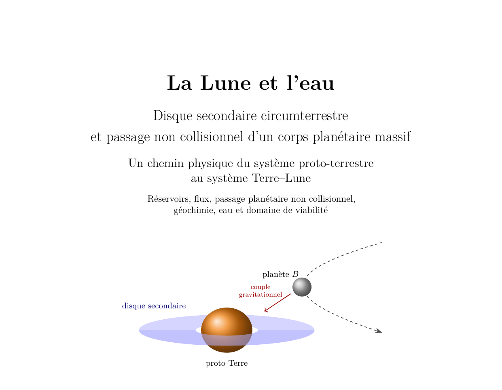

# La Lune et l'eau

## Disque secondaire circumterrestre et passage non collisionnel d'un corps planétaire massif

[Read this README in English](README.md)

**Auteur :** Michel Debailleul
**Formation :** Géophysicien — Master, Université libre de Bruxelles (ULB)
**Version :** v2.0
**Licence :** CC BY-NC 4.0
**DOI :** https://doi.org/10.5281/zenodo.22770198
**ORCID :** 0009-0003-1222-1433



---

## Ce que propose ce travail

Un chemin physique du système proto-terrestre au système Terre–Lune, dans lequel un seul événement
rend compte à la fois de la Lune et de l'eau terrestre.

La proto-Terre tourne près de sa limite, dilatée d'un peu plus d'un dixième, couverte d'un océan
magmatique dont le fer est déjà descendu former le noyau. Elle porte un disque secondaire, comme
toute planète en formation. Un corps venu des régions froides du système passe à trois rayons
terrestres, dans le même sens que la rotation, légèrement incliné pour surplomber le disque.

Pendant les quelques heures où il est proche, son champ de marée soulève la ceinture intertropicale
de l'océan magmatique et en arrache du silicate appauvri en métal. Cette matière rejoint le disque,
s'y circularise, et le transport la porte au-delà de la limite de Roche où elle s'accrète en un
satellite unique. Dans le même temps le corps de passage subit l'inverse : son enveloppe de glace,
portée par le rayonnement de l'océan magmatique, se dilate jusqu'à déborder de son propre lobe de
Roche et cède ses volatils au système terrestre. L'échange est asymétrique, et chacun donne ce que
sa nature lui permet de céder.

Puis il repart, emportant une part de la matière terrestre arrachée et avec elle l'excès de moment
cinétique, et laissant derrière lui une traînée qui continuera de retomber pendant des dizaines de
millions d'années.

---

## Résultats principaux

**Une condition unique.** Le moment cinétique spécifique emporté par chaque couche arrachée admet
une forme close dans laquelle le terme de rotation et le terme d'impulsion de marée partagent la
même dépendance radiale. La condition de franchissement de la limite de Roche se ramène donc à une
seule quantité, combinant la rotation réduite de la proto-Terre, sa dilatation, la masse du
perturbateur et sa distance d'approche.

**Une surface de niveau, et non un volume.** Le long du contour produisant une masse lunaire, cette
quantité reste constante à mieux que 0,5 %, y compris lorsque la distance d'approche varie. Le
domaine viable est une famille à un paramètre : contraindre l'une des quantités fixe les autres.

**Une incertitude confinée.** Changer la structure interne de la proto-Terre modifie la masse
produite d'un facteur neuf, mais ne déplace le seuil que de six pour cent.

**Le passage prograde est requis.** L'impulsion de marée change de signe en rétrograde et ferme
entièrement le canal d'injection. Un calcul par particules test le confirme indépendamment pour le
réservoir préexistant : en prograde, 18,5 % du réservoir atteint la fenêtre lunaire et 84 % de la
masse reste liée ; en rétrograde, la fraction de fenêtre tombe à 4,0 % et 42,5 % s'échappe.

**La géochimie découle de la géométrie.** La matière arrachée provient des couches externes, donc
d'un silicate dont le métal est déjà parti. Le déficit en fer, l'identité isotopique en O, Ti, Cr
et W, et la signature terrestre de l'eau lunaire sont des conséquences de la provenance, non des
hypothèses indépendantes.

---

## Statut méthodologique

Il s'agit d'une **théorie de chemin**, et la distinction compte. La question posée n'est pas de
savoir quel événement unique s'est produit, mais s'il existe un chemin continu, quantitativement
contraint et falsifiable, reliant un état proto-terrestre possible au système Terre–Lune observé.

Le travail définit un domaine viable comme l'intersection de dix-sept portes, et indique pour
chacune si elle est franchie, esquissée, ou reste à chiffrer. Trois le sont sur des bases
quantitatives. Quatre demandent un calcul non encore mené. Les autres reposent sur des arguments
établis mais non chiffrés. Cette carte figure explicitement dans la monographie.

La théorie est falsifiée si aucun domaine continu ne satisfait ensemble les contraintes dynamiques,
géochimiques, isotopiques, thermodynamiques et chronologiques.

---

## Contenu du dépôt

| Fichier | Description |
| --- | --- |
| `LuneEau.tex` | Source LaTeX française |
| `LuneEau.pdf` | Monographie française, 95 pages |
| `MoonWater.tex` | Source LaTeX anglaise |
| `MoonWater.pdf` | Monographie anglaise, 95 pages |
| `couverture_FR.png` | Page de titre française |
| `cover_EN.png` | Page de titre anglaise |

Les deux sources sont autonomes : toutes les figures sont dessinées en TikZ, aucune image externe
n'est nécessaire.

---

## Compilation

```
pdflatex -interaction=nonstopmode LuneEau.tex
pdflatex -interaction=nonstopmode LuneEau.tex
pdflatex -interaction=nonstopmode LuneEau.tex
```

Trois passes sont nécessaires : la première écrit la table des matières et les renvois, la deuxième
les résout, la troisième stabilise la pagination. Ou simplement `latexmk -pdf LuneEau.tex`, qui
s'en charge tout seul.

Une distribution TeX complète est requise (TeX Live, MiKTeX ou MacTeX). La compilation prend
quelques secondes en local ; les services en ligne à durée limitée peuvent expirer.

---

## Mots-clés

Formation de la Lune ; eau lunaire ; volatils ; rapport D/H ; disque circumterrestre ; accrétion
secondaire ; rencontre non collisionnelle ; tri orbital ; moment cinétique ; limite de Roche ;
géochimie lunaire ; instabilité orbitale primitive ; planète éliminée.

---

## Citation

```text
Debailleul, Michel. 2026.
La Lune et l'eau : Disque secondaire circumterrestre et passage
non collisionnel d'un corps planétaire massif.
Version 2.0. Zenodo. https://doi.org/10.5281/zenodo.22723026
```

---

## Licence

**Creative Commons Attribution-NonCommercial 4.0 International (CC BY-NC 4.0)**

© 2026 Michel Debailleul. Vous êtes libre de partager et d'adapter ce travail à des fins non
commerciales, à condition d'en créditer l'auteur. L'usage commercial requiert son autorisation.

---

## Contact et critiques

Michel Debailleul, chercheur indépendant. ORCID 0009-0003-1222-1433.

Ce travail est proposé à la discussion, à la vérification et à la critique. Les objections portant
sur les calculs, sur les portes qui restent à franchir ou sur les contraintes que le chemin doit
satisfaire sont particulièrement bienvenues.
